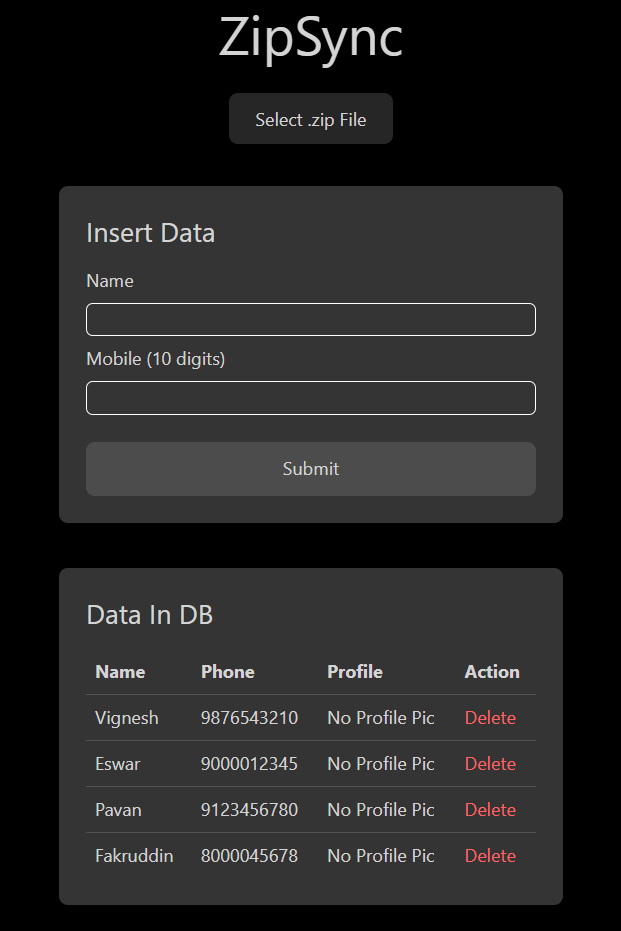
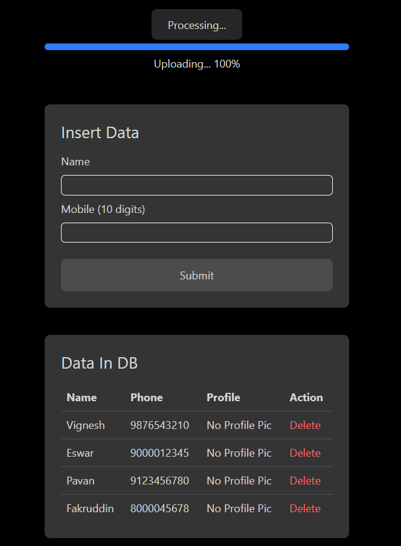
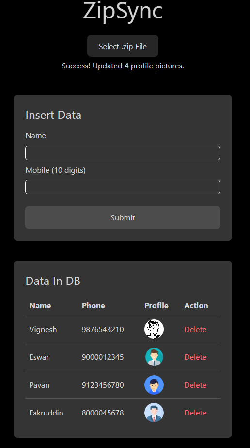

# ZipSync
## Problem Statement

In MySQL, create a users table with the following fields: id, name, mobile and profile photo. Remember the DB has all mobile numbers as 10 digit numbers. Initially all profile photo columns are NULL meaning there is no profile photo. Now create a basic React project with 1 page called Upload Zip. In this page, you should be able to upload a zip file which contains profile photos. Each profile photo name should be like 9191919191.jpg where that number is the mobile number of the user to whom it belongs.
When a user uploads a zip file with multiple images with each image having the name as mobile number of the user, these images should get uploaded onto the server, they should be stored in a directory that can be accessed as a URL and the database column profile photo should get updated. So each user’s profile photo in the zip file is the photo whose name is his mobile number. The frontend should show progress and if possible, meaningful messages while the zip is getting uploaded.

## Database Schema
```sql
CREATE TABLE users (
    id INT AUTO_INCREMENT PRIMARY KEY,
    name VARCHAR(30) NOT NULL,
    mobile VARCHAR(10) NOT NULL UNIQUE,
    profile_pic VARCHAR(100) DEFAULT NULL
);
```

## API Endpoints

| Method | Endpoint       | Description                          |
|--------|----------------|--------------------------------------|
| GET    | /data          | Get all users                        |
| POST   | /newdata       | Create new user                      |
| DELETE | /deleteData/:id| Delete user and associated profile   |
| POST   | /upload        | Process ZIP file with profile pics   |


## Usage Guide
1. **Add Users**:
   - Enter name and 10-digit mobile number
   - Click "Submit" to add to database

2. **Upload Profile Pictures**:
   - Prepare ZIP file with images named as `[10-digit-mobile].jpg/png`
   - Click "Select .zip File" and choose your ZIP file
   - System will automatically process and associate pictures

3. **View Users**:
   - Table displays all users with their profile pictures
   - Pictures are shown as thumbnails with filenames

4. **Delete Users**:
   - Click "Delete" to remove a user record
   - Associated profile picture will also be deleted


## Screenshots



